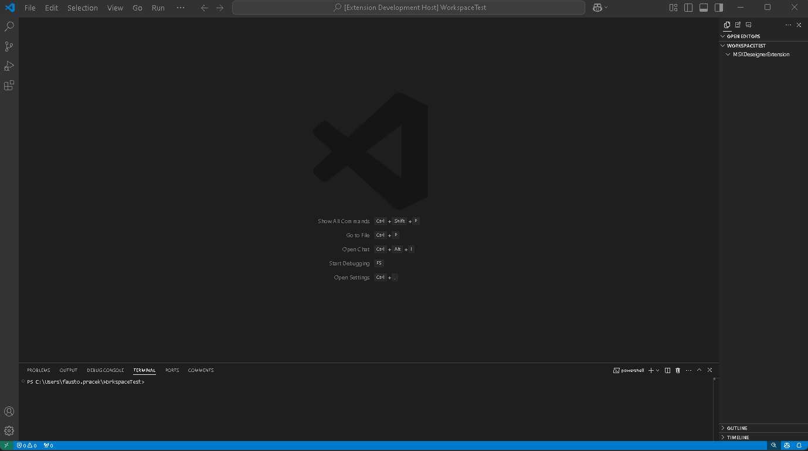
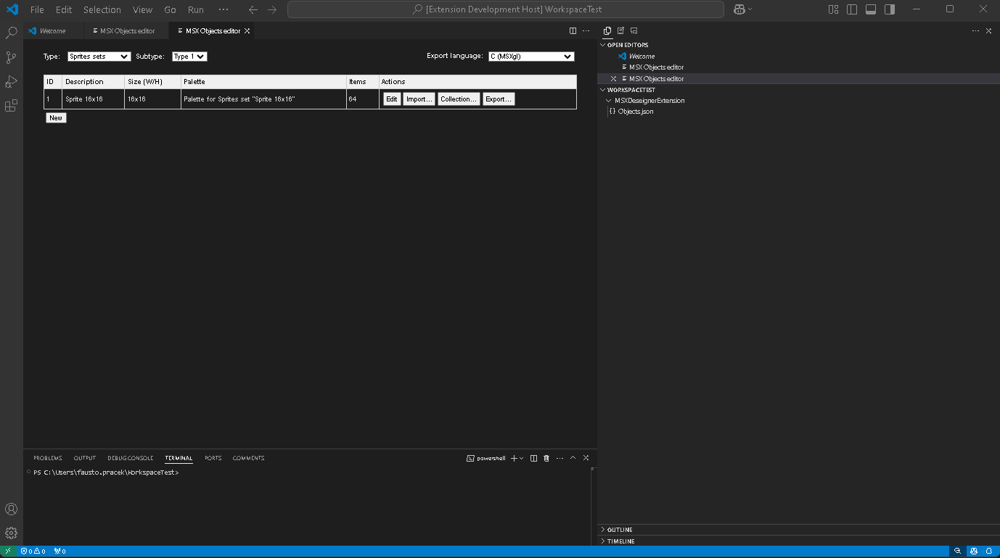
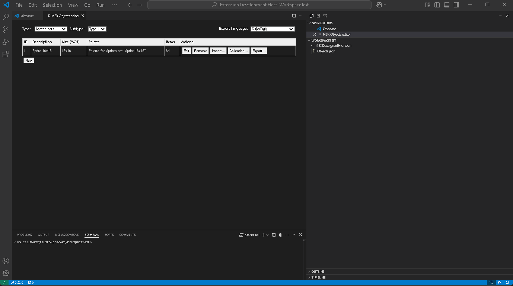
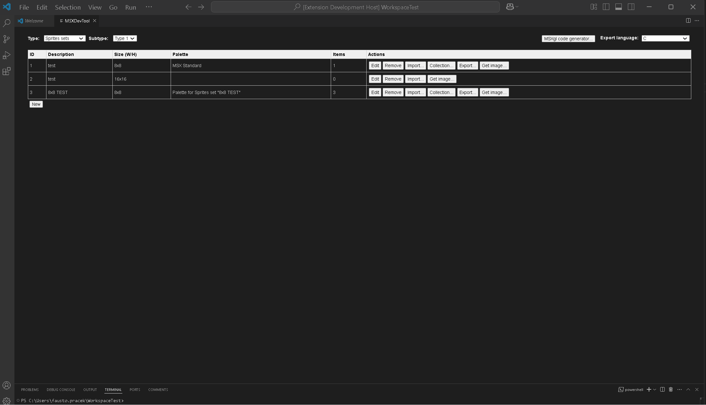
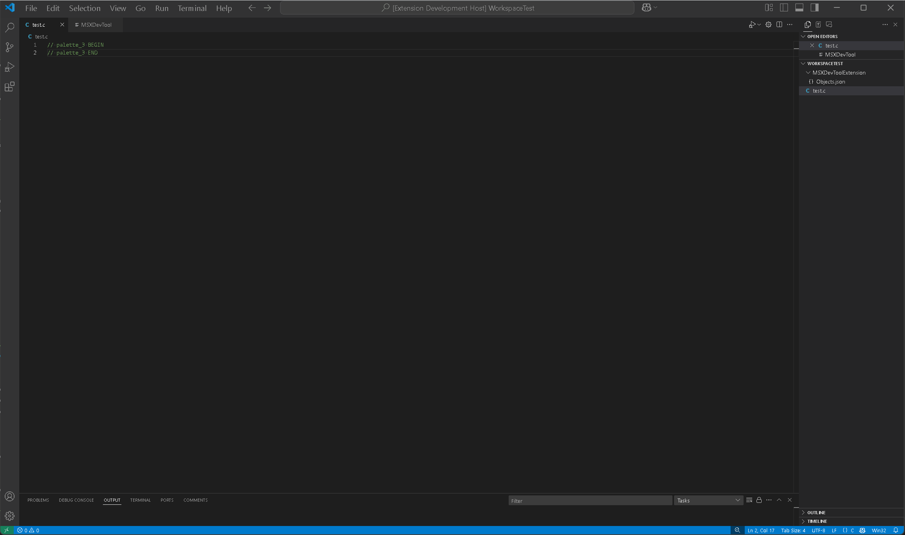

# MSXDevTool Extension

This extension was born from the need to create graphic objects for the creation of games for MSX computers.
It is possible to draw, import and modify sprites (both type 1 and type 2), tiles, fonts, PNG images.
From all these items it is possible to generate the relevant data arrays for use in C, MSX-C, Assembly, Pascal and MSX-BASIC.
There is also a feature to immediately test the movement of the sprites.

For info and issues:
https://github.com/fpracek/MSXDevToolExtension

fpracek@gmail.com

